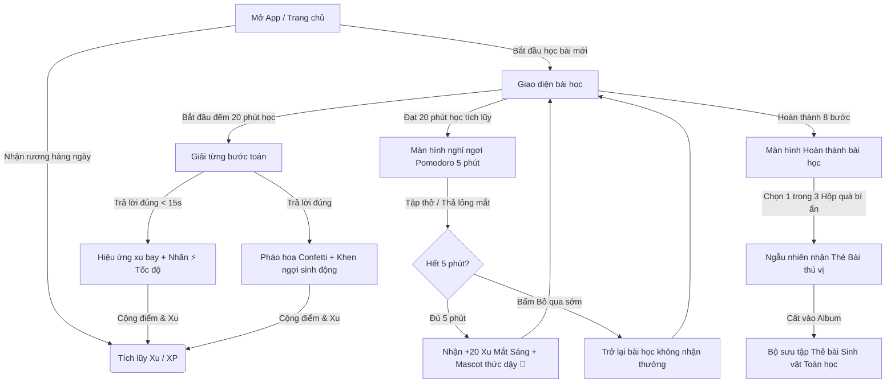

# Proposal: Gamification & Pomodoro Rest Mode (Trải Nghiệm Học Tập Thú Vị & Lành Mạnh)

**Initiative Name:** `gamification-va-pomodoro`  
**Date:** 2026-07-17  
**Author:** Antigravity (CodyMaster AI Pair-programmer)

---

## 1. Why we are doing this (Qualified Problem)

**For:** Các bạn nhỏ đang học toán trên ứng dụng `hoc-toan-vui`.  
**Who:** Đang có nguy cơ giảm hứng thú sau một thời gian học do giao diện học tập còn mang tính học thuật cao, thiếu các điểm chạm giải trí (như Poki.com), và chưa có cơ chế kiểm soát thời gian học lành mạnh để bảo vệ mắt/trí não của bé (học liên tục dẫn đến mỏi mắt).  
**The:** `hoc-toan-vui` là một ứng dụng tự học toán lời văn tương tác  
**That:** Cần được "game hóa" để giữ chân học sinh, biến việc học thành thói quen tự nhiên (Atomic Habits/Hook Framework), tích hợp nhịp độ học lành mạnh (Pomodoro 20 phút học, 5 phút nghỉ), và cung cấp động viên trực quan tức thì.  
**Unlike:** Các app học tập khô khan hoặc game thuần túy không mang tính giáo dục.  
**Our approach:** Đưa cảm giác thỏa mãn (satisfying game feel) từ Poki.com vào các bước học, xây dựng vòng lặp Hook (Gợi nhắc - Hành động - Phần thưởng ngẫu nhiên - Đầu tư) thông qua Hệ thống Thẻ Bài Toán Học & Rương Kho Báu, kết hợp với chế độ nghỉ ngơi Pomodoro tương tác có thưởng.

### Root Causes of Current Gaps:
1. **Thiếu phản hồi tức thì (Instant Feedback):** Khi trả lời đúng, app chỉ có tiếng chuông nhỏ và đổi màu viền, thiếu hiệu ứng thị giác (pháo hoa, xu bay, mascot nhảy múa) kích thích dopamine.
2. **Thiếu cơ chế nghỉ chủ động:** Trẻ em dễ bị cuốn vào màn hình hoặc bị mỏi mắt mà không tự giác dừng lại nghỉ ngơi.
3. **Chưa đo lường tốc độ:** Chỉ ghi nhận đúng/sai mà chưa có thước đo tốc độ học (ví dụ: giải nhanh sẽ nhận được danh hiệu đặc biệt).
4. **Thiếu phần đầu tư (Investment):** XP hiện tại chỉ để hiển thị cấp độ (Level), trẻ chưa thể "tiêu" XP/Coins để cá nhân hóa hoặc sưu tầm cái gì đó cho riêng mình.

### Impact if NOT addressed:
- Tỷ lệ quay lại (Retention) giảm sau khi học hết các bài cơ bản.
- Trẻ học mệt mỏi, mắt điều tiết liên tục không có quãng nghỉ 20/5.
- Không hình thành được thói quen học tập tự giác (Atomic Habit).

---

## 2. 9 Windows Analysis (TRIZ)

| System Level | PAST (Trước đây) | PRESENT (Hiện tại) | FUTURE (Định hướng mới) |
|---|---|---|---|
| **SUPER-SYSTEM** *(Học tập & Sức khỏe)* | Trẻ bị ép học bằng sách vở; dễ mệt mỏi và chán nản. | Các app học tập ra đời nhưng thiếu cơ chế bảo vệ sức khỏe mắt cho trẻ; game Poki gây nghiện cao. | Trẻ tự giác học đều đặn mỗi ngày (Atomic Habit) kết hợp chế độ Pomodoro 20/5 để học tập lành mạnh. |
| **SYSTEM** *(Ứng dụng Học Toán)* | App giải toán 8 bước cơ bản, chấm điểm đúng/sai đơn giản. | Có 33 bài học, có Mascot cố vấn, hệ thống tính XP/Streak, âm thanh Web Audio tự tổng hợp. | App học toán kết hợp Game (Poki-feel): Xu bay, hiệu ứng pháo hoa, Chế độ nghỉ Pomodoro, Tốc độ học, và Cửa hàng Thẻ bài. |
| **SUB-SYSTEM** *(Linh kiện / Code)* | Giao diện React tĩnh, form câu hỏi chuẩn mực. | State quản lý bài học, Chế độ Thử thách mất máu (❤️), lưu LocalStorage. | Thêm State Pomodoro (Timer + Rest Overlay), Component Rương Quà, Animation Canvas/CSS hạt bay, Bảng thành tích tốc độ. |

---

## 3. Options Evaluated

### Option A: Poki-Style Satisfying Mechanics & Pomodoro Focus (Recommended)
* **Concept:** Đưa các hiệu ứng phản hồi thị giác thỏa mãn (confetti, xu bay, popup khen ngợi chuyển động) vào bài học. Tích hợp thanh đo tốc độ giải (đạt mốc "Tia chớp ⚡" nếu giải nhanh và chính xác). Thêm bộ đếm Pomodoro 20 phút học - 5 phút nghỉ (khi đến giờ nghỉ, màn hình sẽ mờ đi hiển thị Mascot đang ngủ và bài tập thở/thả lỏng mắt, kết thúc nghỉ nhận ngay +20 XP). Sử dụng Coins/XP để mở khóa **Thư viện Thẻ Bài Sinh Vật Toán Học** (Math Creatures Card Deck) để trẻ sưu tập.
* **Philosophy:** Trải nghiệm người dùng (UX) và Thói quen lành mạnh.
* **Effort:** Medium-High (~3-4 ngày coding).
* **Pros:**
  - Vòng lặp Hook cực kỳ rõ ràng: Học kiếm Xu $\rightarrow$ Mở rương ngẫu nhiên $\rightarrow$ Sưu tầm thẻ bài.
  - Pomodoro bảo vệ sức khỏe trẻ em, được phụ huynh rất ủng hộ.
  - Tăng độ thỏa mãn thị giác như chơi game Poki nhưng vẫn tập trung vào việc học toán.
* **Cons:** Cần viết thêm CSS chuyển động và logic quản lý thời gian học tích lũy.

### Option B: Mascot RPG Adventure (Nhập vai phiêu lưu cùng Mascot)
* **Concept:** Trẻ chọn Mascot (Rùa Con, Cú Ú, Rô Bốt) làm nhân vật RPG. Đi qua bản đồ các bài học dưới dạng các "vùng đất quái vật". Trả lời toán đúng sẽ giúp Mascot tấn công quái vật. Sau 20 phút, Mascot hết năng lượng (Mana) và phải đi ngủ 5 phút (Rest Mode) để hồi phục. Giải toán nhanh tạo ra sát thương chí mạng (Critical Hit). XP/Coins dùng để mua trang phục/phụ kiện cho Mascot.
* **Philosophy:** Game nhập vai hoàn toàn (RPG-first).
* **Effort:** Very High (Sẽ tốn nhiều thời gian thiết kế sprite, hoạt họa chiến đấu, cơ chế HP/Mana của quái vật).
* **Pros:** Cực kỳ lôi cuốn với trẻ em thích chơi game nhập vai.
* **Cons:** Phức tạp hóa ứng dụng quá mức cần thiết, làm loãng mục đích chính là học toán logic. Tốn nhiều tài nguyên hệ thống.

### Option C: Minimalist Achievements & Basic Timer
* **Concept:** Thêm một bộ đếm giờ Pomodoro hiển thị ở góc màn hình, khi hết 20 phút sẽ hiện thông báo Alert của trình duyệt yêu cầu nghỉ 5 phút (không chặn UI). Tốc độ giải hiển thị bằng số giây giải ở màn hình Complete. XP chỉ dùng để tăng thứ hạng trên một bảng xếp hạng (Leaderboard) ảo.
* **Philosophy:** Tối giản, ưu tiên lập trình nhanh.
* **Effort:** Low-Medium (~1 ngày).
* **Pros:** Code nhẹ nhàng, rủi ro lỗi thấp.
* **Cons:** Thiếu tính tương tác sinh động, trẻ dễ bỏ qua cảnh báo nghỉ, không tạo ra cảm giác "đã" và "thú vị" như Poki.

---

## 4. 🎯 Multi-Dimensional Scoring Matrix

| Tiêu chí | Trọng số | Option A (Poki-feel & Pomodoro) | Option B (RPG Adventure) | Option C (Minimalist) |
|---|---|---|---|---|
| **Tech** (Khả thi, bảo trì, hiệu năng) | 25% | **8.5/10** (Thuần CSS/Canvas nhẹ) | **5.0/10** (Quá nhiều logic game) | **9.5/10** (Rất dễ code) |
| **Product** (Đúng yêu cầu, giá trị thói quen) | 30% | **9.5/10** (Vừa học vừa nghỉ lành mạnh) | **8.5/10** (Dễ gây nghiện quá mức) | **6.0/10** (Khô khan, dễ bị bỏ qua) |
| **Design** (UX đẹp, hiệu ứng sinh động) | 20% | **9.0/10** (Poki feel, pháo hoa, mascot) | **9.5/10** (Giao diện game RPG) | **5.0/10** (Cũ kỹ, không có gì đổi mới) |
| **Business** (Được phụ huynh yêu thích) | 25% | **9.5/10** (Học tốt + nghỉ ngơi bảo vệ mắt) | **7.5/10** (Phụ huynh sợ con nghiện game) | **6.5/10** (Không có điểm nhấn tiếp thị) |
| **Weighted Total** | **100%** | **9.15/10 (Recommended)** | **7.55/10** | **6.85/10** |

---

## 5. 🎯 Chi Tiết Option A: Giải Pháp Đề Xuất (Recommended Option)

### A. Vòng Lặp Hook Framework & Atomic Habits áp dụng:
1. **Trigger (Kích hoạt):** 
   - Mascot Nudge hàng ngày chào mừng bé quay lại khi mở app.
   - Thêm biểu tượng Rương Quà Hằng Ngày (Daily Streak Chest) rung rinh trên trang chủ $\rightarrow$ click để mở nhận Xu ngẫu nhiên.
2. **Action (Hành động):** 
   - Bé tham gia giải toán 8 bước. Mỗi bước giải đúng có âm thanh vui nhộn và hiệu ứng pháo hoa giấy (confetti) bay ra kèm lời khen chuyển động.
3. **Variable Reward (Phần thưởng ngẫu nhiên):**
   - **Hộp Quà Thần Kỳ:** Khi hoàn thành bài học, bé được mở 1 trong 3 hộp quà ngẫu nhiên để nhận thêm Xu (từ 5 đến 30 xu) hoặc nhận được **Thẻ Bài Sinh Vật Toán Học** (ví dụ: "Sứa Số Học", "Cú Khôn Ngoan", "Cá Voi Hình Học").
   - **Tốc Độ Học (Learning Speed Metric):** Nếu bé giải đúng một bước nhanh hơn tốc độ trung bình (ví dụ < 15 giây), app hiển thị dòng chữ động viên siêu tốc: **"⚡ Nhanh như chớp! (+5 Xu tốc độ)"**.
4. **Investment (Đầu tư tích lũy):**
   - **Thư Viện Thẻ Bài (Card Deck):** Trang trí một giao diện album sưu tầm thẻ bài. Các thẻ bài có hình ảnh động vật dễ thương và mô tả vui nhộn về toán học. Trẻ muốn sưu tầm trọn bộ sẽ tự giác học mỗi ngày.
   - **Hồ Sơ Danh Hiệu:** Level càng cao, tên danh hiệu của trẻ càng ngầu (Ví dụ: Tập sự $\rightarrow$ Chiến binh $\rightarrow$ Pháp sư Toán Học).

### B. Chế Độ Nghỉ Ngơi Pomodoro 20/5 (Học Vui - Nghỉ Khỏe):
1. **Bộ đếm thời gian học tích lũy (Study Timer):**
   - App sẽ chạy ngầm một bộ đếm thời gian học thực tế (chỉ đếm khi bé đang ở trong chế độ giải bài học và tab/cửa sổ đang active).
   - Một thanh tiến trình Pomodoro nhỏ, tinh tế hiển thị ở góc màn hình: `⏰ Học: 15/20 phút`.
2. **Màn hình nghỉ ngơi bắt buộc (Rest Screen Overlay):**
   - Khi chạm mốc 20 phút học, app tự động tạm dừng bài học và hiển thị màn hình phủ (Overlay) dễ thương: **"⏰ Đến giờ cho mắt nghỉ ngơi rồi!"**.
   - Mascot Cố vấn sẽ ngáp và đi ngủ (`😴`).
   - Một đồng hồ đếm ngược 5 phút nghỉ ngơi hiện ra.
   - **Hoạt động trong lúc nghỉ:** App hướng dẫn bé bài tập thư giãn ngắn (ví dụ: nhắm mắt lại, nhìn ra xa qua cửa sổ, hoặc hít thở sâu theo nhịp một vòng tròn phồng to/thu nhỏ trên màn hình).
   - **Phần thưởng lành mạnh:** Nếu bé kiên nhẫn đợi hết 5 phút nghỉ ngơi mà không bấm tắt (hoặc làm bài tiếp), bé sẽ nhận được **"Huy hiệu Mắt Sáng 🌟"** và **+20 XP/Coins** như lời cảm ơn từ Mascot.
   - *Lưu ý:* Vẫn có nút "Bỏ qua nghỉ ngơi" nhỏ ở dưới nếu bé thực sự cần làm gấp, nhưng app sẽ khuyến khích bé nên nghỉ.

---

## 6. Sơ Đồ Thiết Kế Linh Hồn Trải Nghiệm (Mermaid Flow)

---

## 7. Next Steps for planning & implementation

Nếu bạn phê duyệt đề xuất này, chúng ta sẽ bắt đầu lập kế hoạch cụ thể với các công việc:
1. **Thiết lập State quản lý Pomodoro:** Quản lý thời gian học tích lũy trong `App.jsx`, lưu vào `sessionStorage` để không bị mất khi F5, hiển thị thông báo Pomodoro Overlay.
2. **Xây dựng hiệu ứng Satisfying Game Feel:**
   - Viết các CSS animation hạt bay (Confetti/Coins) không dùng thư viện ngoài để giữ ứng dụng siêu nhẹ.
   - Tích hợp âm thanh Web Audio mới: Tiếng xu rơi leng keng, tiếng mascot ngáy ngủ `😴`.
3. **Thêm cơ chế Tính Tốc Độ:** Đo khoảng thời gian từ khi bắt đầu bước đến khi click "Kiểm tra". Phân loại tốc độ (Nhanh/Vừa/Chậm) và cộng Xu thưởng.
4. **Tạo Album Sưu tầm Thẻ Bài (Card Collection View):** 
   - Thiết kế danh mục 12-15 thẻ bài động vật toán học dễ thương.
   - Viết logic mở hộp quà bí ẩn ở màn hình `CompleteView`.

---

🎨 **Bạn có muốn xem trước bản vẽ giao diện (UI Preview)?**

Chúng ta có thể tạo ra bản thiết kế UI cho các màn hình:
1. **Màn hình nghỉ ngơi Pomodoro (Rest Screen)** với Mascot ngáy ngủ và vòng tròn thở thư giãn.
2. **Màn hình sưu tập Thẻ bài Sinh vật Toán học (Card Collection Album)**.

Bạn hãy phản hồi để chúng ta thống nhất phương án nhé!
