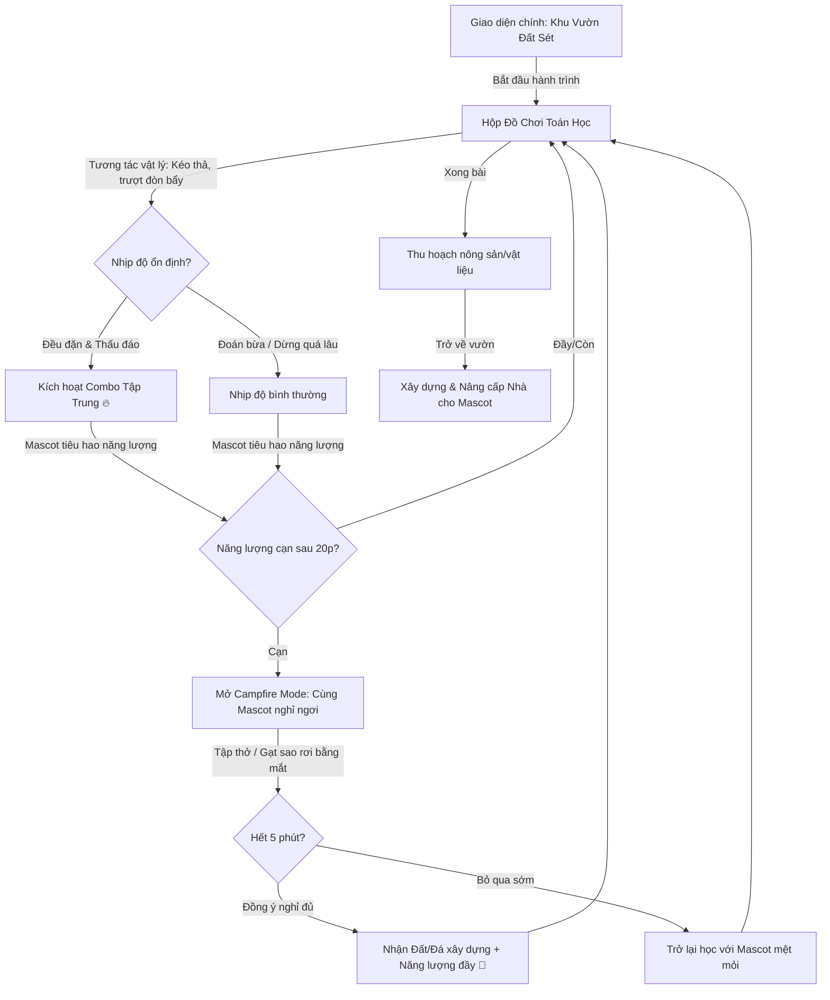

# Đề Xuất Trải Nghiệm Mới: Toybox UI & Vòng Lặp Game Hóa Nội Tại (Intrinsic Flow)

**Initiative Name:** `gamification-va-pomodoro-v2`  
**Date:** 2026-07-17  
**Author:** Antigravity (CodyMaster AI Pair-programmer)

---

## 1. Phân Tích & Phản Tư Từ Hai Bản Vẽ Trước

* **Vì sao Minecraft bị từ chối?** Phong cách pixel thô sơ, màu tối, font chữ diacritics bị lỗi vỡ phông khiến giao diện học thuật trở nên nặng nề, khó đọc, và không phù hợp với các bạn nhỏ cần sự tươi sáng, rõ ràng.
* **Vì sao Phong cách Hiện đại (Duolingo/Kahoot) có vấn đề?** Đây là kiểu game hóa "ngoại lai" (Extrinsic Gamification - Pointsification) phổ biến: chỉ thêm Điểm (XP), Xu (Coins), Bảng xếp hạng, và Mở rương nhãn dán. Học sinh sẽ nhanh chóng nhàm chán khi nhận ra việc học vẫn là đọc chữ và click đáp án khô khan, còn phần thưởng chỉ là những con số ảo. 
* **Vấn đề của Pomodoro chặn màn hình:** Việc ép buộc học sinh dừng học bằng một màn hình khóa đột ngột ngay khi đang trong luồng suy nghĩ (flow state) tạo ra sự ức chế (frustration), phá vỡ trải nghiệm học tập và mang cảm giác như "bị phạt".
* **Vấn đề của Thước đo Tốc độ:** Đo thời gian click nhanh tạo ra **áp lực vô hình (Performance Anxiety)**. Trẻ sẽ có xu hướng đoán bừa hoặc làm vội để lấy điểm "Tia chớp", đi ngược lại triết lý của ứng dụng là "Học cách suy luận thấu đáo từng bước".

---

## 2. Đề Xuất UX & Trải Nghiệm Thay Thế: "Hộp Đồ Chơi Toán Học" (Interactive Toybox)

Chúng ta chuyển dịch từ **"Giao diện làm bài tập"** sang **"Giao diện chơi đùa với các khối toán học"**, lấy cảm hứng từ các tựa game tương tác vật lý cao trên Poki.com và phương pháp Montessori.

### A. Phong cách Thiết kế: Toymorphic & Claymorphism UI
* Giao diện giống như một chiếc hộp đồ chơi bằng gỗ/đất sét mềm mại (Claymorphism): Các nút bấm bo tròn cực lớn, đổ bóng mềm, màu sắc pastel ấm áp (xanh mint, vàng bơ, hồng đào).
* Tránh sử dụng font chữ kỳ lạ. Sử dụng font chữ tiêu chuẩn trẻ em **Lexend** hoặc **Inter** với kích thước lớn ($16\text{px} - 18\text{px}$), khoảng cách dòng thoáng để mắt bé không bị mỏi.

```
┌────────────────────────────────────────────────────────┐
│  🦉 Cố Vấn Cú Ú: "Giúp tớ chia 12 quả táo nhé!"         │
│  [================= Thanh Năng Lượng Mascot ============]│
├──────────────────────────┬─────────────────────────────┤
│  MÔ HÌNH TRỰC QUAN       │  BƯỚC GIẢI TOÁN             │
│                          │                             │
│     👦 Hùng   👧 Lan      │  Bé hãy trượt thanh chia    │
│    [ 🍎🍎 ]  [ 🍎🍎🍎🍎 ] │  táo để Lan có nhiều hơn    │
│    ( 4 quả)  ( 8 quả)    │  Hùng 4 quả nhé!            │
│      ▲         ▲         │                             │
│     [========||========] │  [  Gợi ý 💡 ]   [ Kiểm tra ]│
│       Thanh Trượt Chia   │                             │
└──────────────────────────┴─────────────────────────────┘
```

### B. Game Hóa Nội Tại (Intrinsic Gamification): Học là Chơi Vật Lý
* **Tương tác Vật lý (Toy-like):** Ở mỗi bước giải toán, thay vì chọn đáp án A, B, C khô khan, bé sẽ tương tác trực tiếp:
  * *Tách dữ kiện:* Kéo các khối thông tin thả vào chiếc cân đòn bẩy. Nếu đặt đúng bên, cân sẽ thăng bằng.
  * *Mô hình hóa:* Kéo giãn các thanh gỗ đại diện cho "Lan" và "Hùng" để thấy sự chênh lệch (Hiệu) và tổng độ dài (Tổng) thay đổi trực quan theo thời gian thực.
* **Mascot Nuôi Dưỡng (Mascot Companion Journey):**
  * Mascot (Cú Ú, Rùa Con) nằm trực tiếp ở góc màn hình giải bài và có biểu cảm động lực thực tế. Khi bé làm đúng, Mascot sẽ ăn quả táo trong bài hoặc nhào lộn vui vẻ.
  * XP/Coins tích lũy dùng để mua **vật liệu xây nhà** (gỗ, đá, hoa) để tự tay thiết kế một "Khu vườn Toán học" (Math Garden) cho Mascot của mình. Đây là hoạt động đầu tư lâu dài (Investment) tạo thói quen Atomic Habit.

### C. Cơ Chế Nghỉ Pomodoro Đồng Hành (Cooperative Rest):
* **Thanh Năng Lượng Mascot (Mascot Energy):** Thay vì đồng hồ đếm ngược khô khan, Mascot sẽ có một thanh năng lượng. Mỗi bước học sẽ tiêu tốn một ít năng lượng của Mascot.
* **Giờ cắm trại (Campfire Rest Mode):** Sau khoảng 20 phút học, Mascot sẽ ngáp ngủ và nói: *"Tớ mệt quá, chúng mình cùng đi cắm trại và thư giãn mắt nhé!"*.
* **Trải nghiệm nghỉ ngơi không ức chế:** Bé không bị khóa cứng. Màn hình chuyển sang khung cảnh đêm trại ấm áp. Nhiệm vụ của bé là giúp Mascot "gạt các ngôi sao rơi" trên bầu trời bằng mắt (Eye-tracking movement / luyện cơ mắt) hoặc cùng Mascot hít thở sâu theo nhịp đốm lửa sưởi ấm bay lên.
* **Hoàn thành tự nguyện:** Nếu bé hoàn thành 5 phút giải lao cùng Mascot, cả hai sẽ nhận được những vật liệu hiếm để xây vườn. Nếu bé bấm "Bỏ qua", Mascot vẫn tiếp tục học nhưng sẽ có biểu cảm mệt mỏi (khuyến khích lòng trắc ẩn của trẻ để tự giác nghỉ).

### D. Tốc Độ Học: Nhịp Độ Đều Đặn (Consistent Flow Combo):
* Loại bỏ bộ đếm thời gian nhanh/chậm gây áp lực.
* Thay vào đó, đo lường **Nhịp độ tư duy đều đặn (Pace)**. Nếu bé hoàn thành các bước một cách liên tục mà không bị dừng quá lâu (không bấm bừa liên tiếp), bé sẽ kích hoạt **"Combo Tập Trung"** (glowing focus state). Trạng thái này giúp tăng năng lượng hồi phục cho Mascot và nhân đôi vật liệu thu hoạch.

---

## 3. Sơ Đồ Trải Nghiệm Mới (Toybox UX Flow)



---

## 4. Bản Vẽ Giao Diện Đề Xuất (Interactive Toybox Preview)

Chúng ta có thể dựng một bản mẫu HTML `public/prototype-toybox.html` tập trung vào:
1. **Phong cách Claymorphism:** Giao diện màu pastel tươi sáng, các khối nút bấm 3D tròn trịa như đất nặn.
2. **Cơ chế mô hình kéo trượt trực quan:** Mô phỏng bài toán Lan và Hùng bằng thanh trượt chia táo động.
3. **Campfire Rest Mode:** Giao diện cắm trại ban đêm với bóng thở lửa ấm áp và Mascot ngáp ngủ.
4. **Khu vườn Mascot:** Bản mẫu thu nhỏ hiển thị nơi bé dùng gạch/gỗ xây nhà cho thú cưng.

Bạn thấy hướng tiếp cận **Intrinsic Gamification (Game hóa nội tại thông qua tương tác vật lý và nuôi thú nuôi)** này có giải quyết được các hạt sạn của bản cũ không? Hãy cho tôi biết để tôi dựng bản vẽ nhé!
