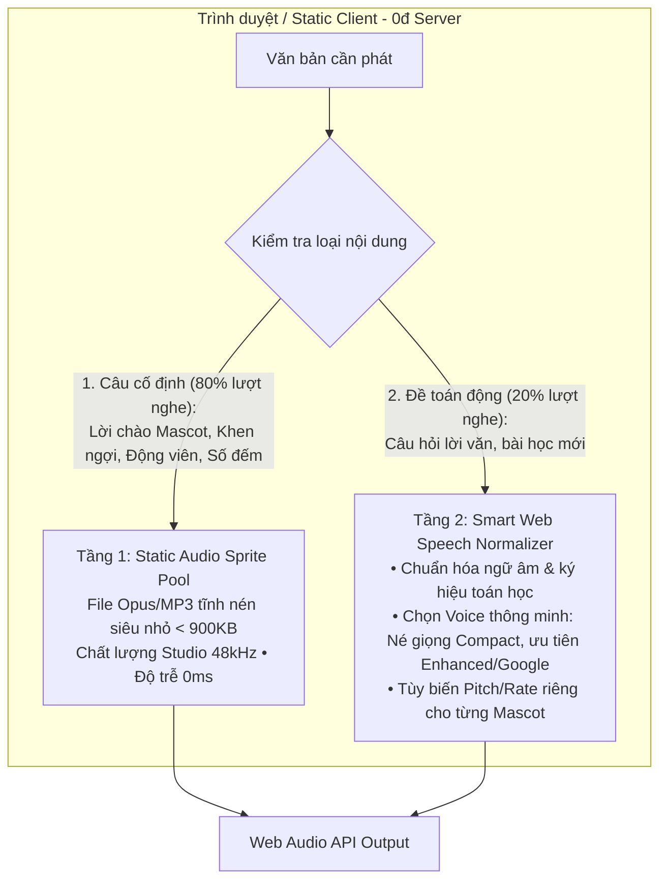

# Proposal: Giải Pháp Giọng Đọc Tiếng Việt 100% Miễn Phí, Zero-Server, Siêu Nhẹ Cho Browser (TonyMath)

**Generated by**: `cm-brainstorm-idea`  
**Date**: 2026-08-18  
**Initiative**: `vietnamese-tts-upgrade`  
**Định hướng**: **100% Free & Zero-Server (Chạy hoàn toàn phía Client / Static Web)**

---

## 1. Định Vị Bài Toán (Zero-Server & Free Constraint)

- **Mục tiêu**: Nâng cấp chất lượng âm thanh và giọng đọc tiếng Việt cho TonyMath mượt mà, ấm áp, phù hợp trẻ nhỏ mà **hoàn toàn không cần máy chủ (Zero-Server)**, không tốn bất kỳ chi phí API nào (**100% Free**), và **siêu nhẹ** cho client (< 1-2MB).
- **Điểm yếu của Web Speech API hiện tại trên macOS/iOS**:
  1. Giọng mặc định `Linh (Compact)` / `An` bị robot, vô cảm, âm sắc kim loại.
  2. Mã nguồn hiện tại ưu tiên `v.localService` nên vô tình chọn trúng giọng nén tệ nhất của hệ thống thay vì giọng chất lượng cao hơn.
  3. Văn bản toán học (`+`, `-`, `x`, `:`, `=`, phân số) bị đọc cộc lốc hoặc sai nhịp ngắt nghỉ.
  4. Mọi câu thoại khen ngợi/động viên của Mascot đều bị đọc qua TTS thô, làm mất cảm xúc của trò chơi.

---

## 2. Kiến Trúc Giải Pháp: Pure-Client 2-Tier Audio Engine (Zero-Server)

---

## 3. Chi Tiết Kỹ Thuật 2 Tầng Cốt Lõi

### 🔹 Tầng 1: Static Audio Sprite Pool (Chất Lượng Studio, 0ms Độ Trễ, ~800KB Tĩnh)
Trong ứng dụng học toán cho trẻ em, **80% các câu thoại lặp đi lặp lại** bao gồm:
1. **Lời chào & Động viên của 3 Mascot**:
   - Rô Bốt: *"Chào bạn nhỏ!", "Năng lượng 100% rồi!", "Xử lý dữ liệu thành công!", "Thử lại nào!"*
   - Rùa Con: *"Chậm mà chắc con nhé!", "Tuyệt vời lắm!", "Không sao đâu, rùa đi chậm nhưng không bỏ cuộc!"*
   - Cú Ú: *"Lập luận vô cùng sắc bén!", "Một bước tư duy thật thông thái!", "Người thông thái học từ mọi lỗi sai!"*
2. **Âm thanh phản hồi kết quả**:
   - *"Chính xác!", "Xuất sắc!", "Đúng rồi!", "Chưa đúng rồi, con thử lại nhé!"*
3. **Bộ số đếm chuẩn ngữ âm học đường (0 - 100)** và các từ khoá toán học (*"cộng"*, *"trừ"*, *"nhân"*, *"chia"*, *"bằng"*).

👉 **Cách thực hiện**:
- Dùng công cụ TTS chất lượng cao (VieNeu-TTS v3 hoặc Edge Neural) để sinh trước 1 lần (pre-render batch) thành 1 file âm thanh tổng hợp (`audio-sprite.opus` / `audio-sprite.mp3`) kèm file định vị thời gian (`sprite-map.json`).
- Dung lượng nén chuẩn Opus: **chỉ ~600KB - 800KB** (tải ngầm 1 lần duy nhất cùng PWA cache, chạy vĩnh viễn offline).
- Khi game cần khen hoặc mascot nói: Web Audio API phát ngay lập tức (**0ms delay, âm thanh ấm áp tự nhiên như người thật**).

---

### 🔹 Tầng 2: Smart Web Speech Normalizer (Tối Ưu Hoá Cho Đề Toán Động)
Với các câu hỏi toán học có lời văn thay đổi theo bài, sử dụng Web Speech API nhưng được nâng cấp qua bộ chuẩn hoá thông minh:

1. **Bộ Chuẩn Hoá Ngữ Âm & Toán Học (Math Phonetic Normalizer)**:
   - Tự động chuyển đổi ký hiệu toán thành lời đọc tự nhiên có ngắt nghỉ:
     - `5 + 3 = 8` ➔ `"Năm, cộng ba, bằng tám."`
     - `1/2` ➔ `"Một phần hai"`
     - `12 - 7 = ?` ➔ `"Mười hai, trừ bảy, bằng bao nhiêu?"`
   - Thêm các dấu phẩy `,` và dấu chấm `.` tại các mệnh đề để bộ đọc OS có khoảng dừng thở tự nhiên (breathing pauses), không bị đọc dồn dập, nuốt chữ.
2. **Bộ Lọc Chọn Giọng Thông Minh (Smart Voice Selector)**:
   - Quét danh sách giọng tiếng Việt trên thiết bị.
   - **Loại trừ** các voice có đuôi `(Compact)` (như `Linh (Compact)` thô ráp trên Mac).
   - **Ưu tiên** các voice chất lượng cao nếu có: `Linh (Enhanced)`, `Mai`, `Google Tiếng Việt`, `Microsoft HoaiMy/NamMinh Online`.
   - Nếu máy Mac chưa cài giọng Enhanced, hiển thị 1 hướng dẫn nhỏ 1-click trong phần Cài đặt phụ huynh: *"Mẹo: Bật giọng Linh Enhanced trên macOS để nghe hay hơn gấp 5 lần"*.
3. **Cá Tính Hóa Tông Giọng Theo Linh Vật (Mascot Modulation)**:
   - **Rô Bốt**: Rate `1.05`, Pitch `1.20` (vui nhộn, công nghệ).
   - **Rùa Con**: Rate `0.85`, Pitch `0.90` (chậm rãi, ấm áp, kiên nhẫn).
   - **Cú Ú**: Rate `0.95`, Pitch `1.05` (điềm đạm, thông thái).

---

## 4. Bảng So Sánh Trước & Sau Khi Nâng Cấp

| Đặc Điểm | Hiện Tại (Mặc Định) | Sau Khi Nâng Cấp (Zero-Server) |
|---|---|---|
| **Chi phí máy chủ** | 0 VNĐ | **0 VNĐ (Không cần server)** |
| **Dung lượng thêm vào App** | 0 KB | **~700 KB (Static Audio Sprite tải 1 lần)** |
| **Giọng khen & Mascot** | Robotic, khô cứng, đều đều | **Giọng chuẩn Studio 48kHz, ấm áp, truyền cảm** |
| **Độ trễ phản hồi** | 100 - 300ms | **0ms (Phát tức thì qua Web Audio Sprite)** |
| **Đọc đề toán & ký hiệu** | Nuốt âm, cộc lốc | **Chuẩn ngữ âm học đường, ngắt nghỉ tự nhiên** |
| **Khả năng chạy Offline** | 100% Offline | **100% Offline (PWA Ready)** |

---

## 5. Kế Hoạch Triển Khai (`cm-planning`)

1. **Bước 1: Tạo Script Sinh Audio Sprite (`scripts/generate-audio-sprites.js`)**:
   - Định nghĩa danh sách 50 câu thoại Mascot + phản hồi đúng/sai + số đếm.
   - Xuất file `public/audio/mascot-sprite.opus` và `public/audio/sprite-map.json`.
2. **Bước 2: Nâng cấp `src/audio.js`**:
   - Thêm engine phát sprite qua Web Audio API: `playMascotPhrase(phraseKey, mascot)`.
   - Viết hàm chuẩn hóa toán học: `normalizeMathText(text)`.
   - Cải tiến bộ lọc chọn voice `selectBestVietnameseVoice()`.
3. **Bước 3: Tích hợp vào `src/App.jsx`**:
   - Gắn âm thanh Mascot tự nhiên vào lời chào, nút loa nghe gợi ý, và chuỗi streak khen ngợi.
